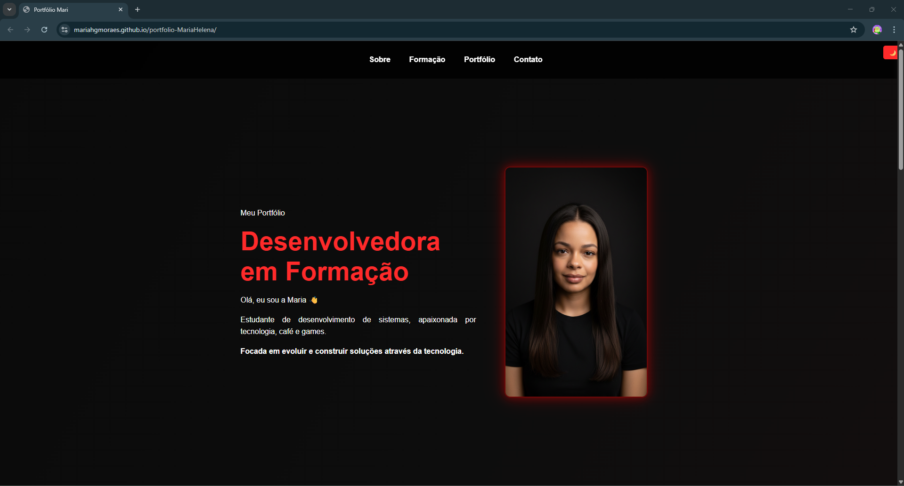

# 🌐 Portfólio Web | Maria Helena Moraes

🚀 Projeto desenvolvido com HTML, CSS e JavaScript puro.

## 📸 Preview

---

## 👩‍💻 Sobre

Oi! Eu sou a Maria 😊  
Sou estudante de desenvolvimento de sistemas apaixonada por tecnologia, café e games.  

**Focada em evoluir e construir soluções através da tecnologia.**

---

## 🚀 Tecnologias utilizadas

- HTML5  
- CSS3  
- JavaScript  

---

## 📂 Estrutura do projeto

- `index.html` → estrutura do site  
- `style.css` → estilização  
- `script.js` → interatividade  
Projeto desenvolvido utilizando o modelo Single Page com navegação por âncoras, conforme permitido na atividade.
---

## ✨ Funcionalidades

- Navegação entre seções (Single Page)  
- Validação de formulário com JavaScript  
- Tema claro/escuro 🌙☀️  
- Layout responsivo 📱  
- Scroll suave  

---

## 🔗 Acesse o projeto

👉 [Acesse o projeto](https://mariahgmoraes.github.io/portfolio-MariaHelena)

---

## 📌 Autor

Maria Helena Moraes  
📍 Curitiba - PR  

- GitHub: https://github.com/MariaHGMoraes  
- LinkedIn: https://www.linkedin.com/in/mariahelenagdemoraes/
